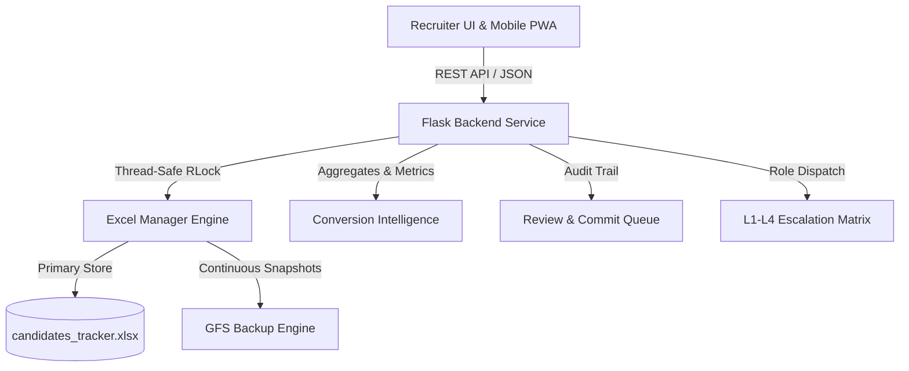

# 👥 Employee-Finder: Candidate Sourcing & Conversion Intelligence System

A high-performance, mobile-responsive Candidate Tracking & Recruitment Intelligence System designed for executive search, talent sourcing, and conversion optimization with two-way Excel synchronization, staging review workflows, multi-tiered task escalation (L1–L4), Grandfather-Father-Son (GFS) backups, and interactive analytics.

---

## 🎯 Why Was This System Built? (Project Background & Motivation)

During high-volume candidate outreach and executive talent scouting, recruiters face significant hurdles:
1. **Spreadsheet Fragility & Overwrites**: Managing hundreds of candidates across standard Excel files often causes accidental data loss, concurrent write conflicts, and loss of historical notes.
2. **Slow Mobile Outreach**: Sourcing teams making phone calls or WhatsApp follow-ups while on the move have trouble typing back into desktop spreadsheets.
3. **Lack of Conversion Intelligence**: Teams source hundreds of profiles, but lack visibility into critical drop-off points:
   - *How many people did we actually call?*
   - *From which background/industry do people actually respond?*
   - *Who agrees to interview vs. meeting in person?*
   - *Who expresses interest in Advisory or Consulting roles?*
4. **Uncoordinated Multi-Level Review**: Escalating candidates between Sourcing Recruiters, Tech Reviewers, Department Heads, and Executive Approvers usually leads to chaotic email threads.

**Employee-Finder was purpose-built to solve these bottlenecks** by pairing the reliability of an Excel master database with a sleek, reactive web & mobile interface and automated conversion analytics.

---

## 🏗️ Architecture & Why It Was Built In This Manner



### Key Architectural Choices:
- **Python / Flask Backend**: Lightweight, zero heavy database infrastructure required (runs directly off the local/network environment).
- **Thread-Safe Excel Sync (`RLock` + OpenPyXL)**: Allows real-time reading and updating of `.xlsx` without locking file handles or corrupting formatting.
- **Strict UAT & Production Segregation**:
  - `Production_Version/`: Golden master copy of verified code and data.
  - `UAT_Testing/`: Staging and active feature experimentation area (testing new columns, analytics, mobile UI updates) before merging.
- **Zero Real PII in GitHub**: Uses anonymized synthetic records (`@example.com`, masked phone numbers) in Git while keeping genuine candidate data in protected local folders.
- **Zero-Crash Event Architecture**: All DOM listeners are guarded with null-safety checks, ensuring runtime stability across both desktop and mobile viewports.

---

## 🌐 Live Access & Testing Endpoints

| Target | URL | Purpose |
| :--- | :--- | :--- |
| 💻 **Recruiter Desktop Dashboard** | [http://127.0.0.1:5000](http://127.0.0.1:5000) | Full recruiter control center, card editor, filtering, reviews, backups & analytics |
| 📱 **Android / Mobile LAN** | [http://192.168.29.55:5000](http://192.168.29.55:5000) | Mobile touch PWA with 1-tap Phone Call, WhatsApp, and Quick Action buttons |

---

## ⚡ Key Features & Modules

### 1. 📊 Interactive Conversion Intelligence Analytics
*Designed specifically to identify which candidate backgrounds respond and convert into meetings or advisory roles:*
- **End-to-End Conversion Funnel**: Visualizes drop-offs from *Sourced* → *HR Called* → *Positive Response* → *Interview / Meeting Agreed* → *Advisory Role Accepted*.
- **Domain & Industry Response Breakdown**: Tracks response rates by industry (e.g., Banking, Aerospace, Defence, IT).
- **Experience vs. Conversion Matrix**: Identifies whether senior (10+ yrs) or mid-level (5-10 yrs) profiles respond faster.
- **Meeting Type Distribution**: Breakdown of candidates preferring *In-Person Meetings*, *Video Calls*, or *Phone Screenings*.
- **Advisory Role Interest Tracking**: Dedicated reporting on high-level executives interested in strategic advisory or board positions.

### 2. ⚡ Multi-Tier Escalation Matrix (L1 to L4)
Assign and route candidate profiles across organizational levels in 1 click:
- **`L1 - HR Person`**: Recruiter / Sourcing Lead.
- **`L2 - Raj`**: Lead Reviewer & Tech Sourcing.
- **`L3 - Chaitali`**: Hiring Manager / Department Lead.
- **`L4 - Matthew`**: Executive Approver / Final Authority.
- Supports standardized action categories: `Need to Talk`, `Review / Suggest`, `Interview Decision`, `Other / Custom Action`.
- **Interactive Metric Chips**: Click any person or level chip in the top metrics bar to instantly filter candidates assigned to them.

### 3. 📝 18-Field Box-Item Form Editor
- **Contact & Profile**: Name, Role/Designation, Phone Numbers, Email, Location, Total Experience.
- **Professional Background**: Current Position, Domain/Industry Category, Educational Qualifications.
- **Recruitment Logistics**: Sourcing Portal, HR Called Status, Mandatory Call Date Validation, Call Response.
- **Conversion Tracking**: Interview / Meeting Agreed status & Advisory Role Interest.
- **Notes & Logs**: Recruiter Call Notes, Escalation Comments, Reviewer Remarks.

### 4. 🚫 1-Tap Quick Close & Not Interested Management
- Instantly mark non-responsive or non-interested candidates with the **🚫 Quick Close** button.
- Automatically sets candidate status to `Closed - Not Interested`, stamps the current date, and syncs to Excel.
- Dedicated **`Closed (Not Int.)`** counter card on the dashboard to filter and review.

### 5. 🗄️ Automated GFS Backups & Point-in-Time Recovery
- **Grandfather-Father-Son (GFS)** strategy:
  - **Session Snapshots**: Captured on save/update events.
  - **Daily Snapshots**: Automated daily milestones.
  - **Weekly & Monthly Archives**: Point-in-time recovery archives.
- Dedicated **Backups Tab** allows on-demand snapshot creation, visual inspection, and instant rollback.

### 6. 📱 Android Mobile Connectivity & QR Access
- Generate dynamic LAN QR codes inside the app to load the full recruitment interface on Android smartphones.
- Mobile viewport includes bottom navigation, 1-tap `tel:` and WhatsApp `wa.me` links, and summary generator.

---

## 🛡️ Data Privacy & GitHub Zero-PII Policy

To safeguard confidential candidate contact details:
1. **Zero Real PII in Git**: Real candidate CVs (`.pdf`, `.docx`), personal phone numbers, and genuine emails are excluded via `.gitignore`.
2. **Safe Tracked Datasets**: All repository sample spreadsheets use realistic synthetic dummy data (`+91 98765 0000X`, `@example.com`).
3. **Protected Local Storage**: Master datasets with live recruiter call notes reside strictly in `local_private_backup/` and auto-restore after code commits.

---

## 🧪 Automated Testing & Verification

Every feature and UI modification is verified through automated Playwright test suites:
- **E2E Desktop Test Suite**: `python playwright_e2e_test.py` (Tests search, metric filtering, form editing, staging queue, reviewer creation, backups).
- **Mobile Touch Suite**: `python playwright_android_mobile_test.py` (Tests mobile viewport, quick contacts, and responsive layouts).

For step-by-step test execution and manual testing sequences, refer to:
📄 **[TEST_EXECUTION_GUIDE.md](file:///c:/Users/Raj/Projects/Employee-Finder/TEST_EXECUTION_GUIDE.md)**

---

## 📂 Project Structure

```
Employee-Finder/
├── Production_Version/              # Stable production baseline
│   └── candidate_app/
├── UAT_Testing/                     # Active staging & testing environment
│   └── candidate_app/
│       ├── app.py                   # Flask server & REST API (including /api/analytics)
│       ├── excel_manager.py         # Thread-safe Excel synchronization engine
│       ├── candidates_tracker.xlsx  # Active Excel candidate database
│       ├── reviewers.json           # Reviewer contact registry (L1-L4)
│       ├── templates/index.html     # Single-page application UI
│       ├── static/
│       │   ├── css/style.css        # Responsive styling & themes
│       │   └── js/app.js            # Frontend logic & Chart.js visual analytics
│       ├── playwright_e2e_test.py   # Automated end-to-end test suite
│       └── backups/                 # Rolling GFS backup repository
├── local_private_backup/            # Protected offline backup of master real candidate data
├── GEMINI.md                        # Strict project & privacy enforcement rules
├── TEST_EXECUTION_GUIDE.md          # Step-by-step testing manual
└── README.md                        # Master project documentation
```
