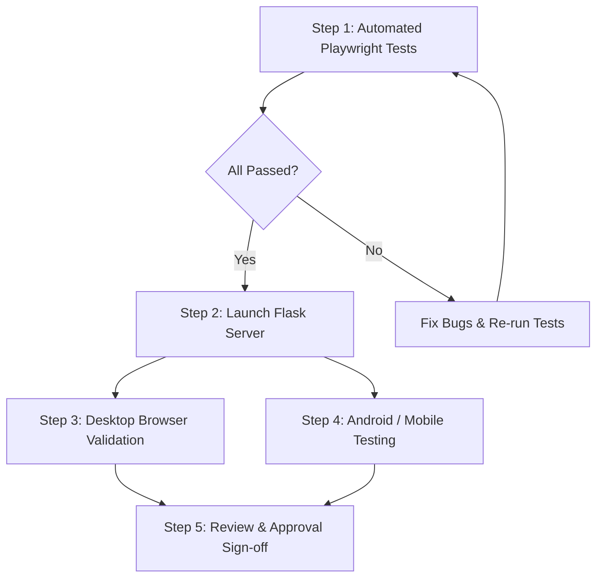

# 🧪 Candidate Tracker: Testing & Execution Guide

This document provides the standard step-by-step sequence for running automated Playwright tests, launching the live server, and conducting manual validation on desktop and mobile.

---

## 🌐 Quick Access URLs for Testing

| Interface | Access URL | Usage |
| :--- | :--- | :--- |
| 💻 **Desktop / Localhost** | [http://127.0.0.1:5000](http://127.0.0.1:5000) | Main dashboard on your PC |
| 📱 **Mobile / Android / LAN** | [http://192.168.29.55:5000](http://192.168.29.55:5000) | Scan QR code or open in phone browser |

---

## 📋 Standard Testing Sequence & Workflow

Follow this sequence for every test cycle:



---

### **Step 1: Run Automated Playwright Test Suites**

Open your PowerShell terminal and run the test suites:

#### 1.1 Desktop E2E Suite (8 Scenarios)
```powershell
cd c:\Users\Raj\Projects\Employee-Finder\candidate_app
python playwright_e2e_test.py
```
* **What it tests**: Dashboard KPI cards, dynamic search & portal filters, 15-field box-item editor, candidate share summary generation, review & approval queue with visual diffs, reviewer registry, and QR code generation.

#### 1.2 Android Mobile Viewport & Touch Suite
```powershell
python playwright_android_mobile_test.py
```
* **What it tests**: Emulates Google Pixel 7 (393x851), checks zero horizontal overflow, font/box sizing adjusters (`A-`, `A+`, `Reset`), mobile bottom navigation, and 1-tap call/WhatsApp action buttons.

#### 1.3 Full Recruiter Human Simulation Suite
```powershell
python playwright_human_simulation_test.py
```
* **What it tests**: Multi-step recruiter workflow, editing candidate details, staging for review, and committing updates to master Excel.

---

### **Step 2: Start the Local Web & Mobile Server**

To test manually in your browser or phone:

```powershell
cd c:\Users\Raj\Projects\Employee-Finder\candidate_app
python app.py
```
*(Or double-click `run_app.bat` in `candidate_app/`)*

---

### **Step 3: Desktop Manual Verification Checklist**

1. Open [http://127.0.0.1:5000](http://127.0.0.1:5000) in Chrome/Edge.
2. **KPI Metrics Cards**:
   - Check **Total Sourced**, **HR Called**, **Pending Calls**, **Follow-ups**, and **Pending Reviews**.
3. **Live Search & Filter**:
   - Type candidate name into search bar; verify instant filtering.
   - Filter by portal (`Naukri`, `LinkedIn`, `Indeed`, `WorkIndia`).
4. **Candidate Card Quick Actions**:
   - ✏️ **Edit Box Items**: Click pencil icon to edit 15 fields.
   - 📤 **Share Profile**: Click share icon to generate formatted summary for WhatsApp/Email.
   - 📞 **Call**: Triggers tel prompt.
   - 💬 **WhatsApp**: Opens chat with pre-filled message.
5. **Review & Approval Queue**:
   - Switch to **Review Queue** tab.
   - Inspect side-by-side visual diffs (Original vs Changed).
   - Click **Approve & Commit to Excel** to write changes to master tracker.
6. **Reviewer Registry**:
   - Switch to **Reviewers** tab to view or add team reviewers.

---

### **Step 4: Mobile & Android Verification Checklist**

1. Ensure your Android device is connected to the same Wi-Fi network.
2. Open phone browser and go to [http://192.168.29.55:5000](http://192.168.29.55:5000) (or scan the on-screen QR code from the **Mobile Connect** tab on desktop).
3. **Verify Mobile UI**:
   - Verify zero horizontal scrolling.
   - Test **A- / A+ / Reset** sizing controls at top right.
   - Test bottom navigation tabs (**Candidates**, **Reviews**, **Reviewers**, **QR Code**).
   - Tap 📞 **Call** and 💬 **WhatsApp** buttons to verify mobile intent integration.

---

### **Step 5: Inspect Test Screenshots**
All Playwright screenshots are automatically saved to:
📂 `c:\Users\Raj\Projects\Employee-Finder\candidate_app\test_screenshots\`
